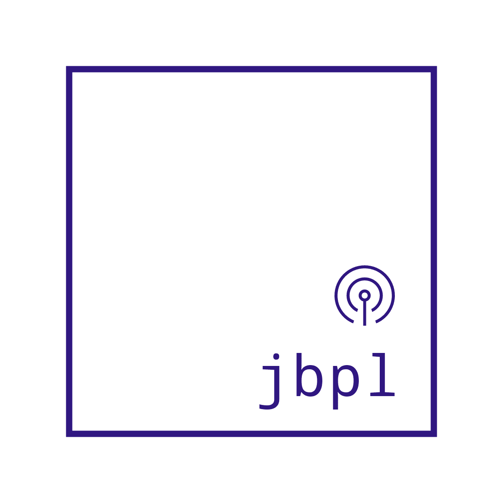

# JBPL

<center> 
</center>


JBPL is a programming language designed and built from scratch with the main aim being
to provide a working example on how to develop compilers and interpreters for
anyone wanting to venture in the latter fields.

## PROJECT OBJECTIVES

- Foremost, to provide a solid and working example of compiler/interpreters development.
- A production environment ready programming language.
- Platform for target learners to contribute both in ideas and code.
- Become a Bootstrap language (language internals implemented/written in its own language).
- Learning about the internals of both compilers and interpreters.
- Give me something constructive to do.

## DEVELOPMENT TOOLS

#### Language

 - C (initial).
 - JBPL (once bootstrap is attained).

#### Editors
 - <a href="https://kate-editor.org/">KATE</a>. (Project's main editor)
> Any editor that has native or LSP support for C and CMAKE is usable.

#### Build system
 - <a href="https://cmake.org">CMAKE</a>.

#### Documentation
- <a href="https://en.wikipedia.org/wiki/Markdown">Markdown</a>

#### Version Control
 - <a href="https://git-scm.com/">GIT</a>

#### Development Platform
 - POSIX compliant Operating system. <a href="https://en.wikipedia.org/wiki/POSIX#POSIX-oriented_operating_systems">See list</a>

## Getting started
Since this project will be under rapid development no official pre-compiled binaries will be released. Instead JBPL will be available by building from source.

#### Building from source
```bash
$ git clone https://github.com/bumbuna/JBPL.git
$ cd JBPL
$ cmake -B build
$ cmake --build build
```

#### Usage
```bash
$ jbpl sourcecode.jbpl
$ jbpl --help
```

## Project Roadmap
- [x] Project Creation.
- [ ] JBPL pre-Processor.
- [ ] JBPL Lexical Analyzer.
- [ ] JBPL Parser.
- [ ] JBPL Symbol Table.
- [ ] JBPL Optimizer.
- [ ] JBPL Byte Code.
- [ ] JBPL Interpreter Backend.
- [ ] JBPL Native Backend.

## Contribution
Contributions and suggestions towards any aspect of the project are welcomed.
You may reach out to me on any of the following platform or chat forums:
- [Twitter](https://twitter.com/devbumbuna)
- [JBPL Discord Server](https://discord.com/channels/1031513376133746728)
- [Email](mailto:jbpl@devbumbuna.com)
